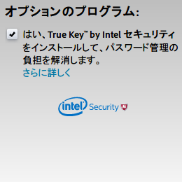
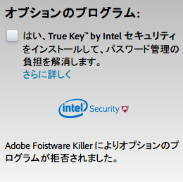

Adobe Foistware Killer
======================

Adobe製品ダウンロード時の「オプションのプログラム」のチェックボックスを自動的に解除するGreasemonkey/Tampermonkey用ユーザースクリプト

## 概要

Adobe Foistware Killer は、Adobe製品ダウンロード時の「オプションのプログラム」のチェックボックスを自動的に解除するGreasemonkey/Tampermonkey用ユーザースクリプトです。

Flash Player や Acrobat Reader DC などのAdobe製品のダウンロードページでは、McAfee Security Scan Plus などの無関係なソフトウェアのインストールを勧められる場合があります。

チェックを外すことによりそれらの提案は拒否できますが、最初からチェックが入った状態となっているために、不注意で「今すぐインストール」ボタンを押してしまうと不必要なソフトウェアをインストールさせられることになります。

本スクリプトは、Adobe製品のダウンロードページにおいて「オプションのプログラム」を検出すると、チェックボックスを自動的に解除します。

## ライセンス
[MIT License](http://opensource.org/licenses/MIT)

## 作者
[たかだか。(TakaDaka.)](https://twitter.com/djtkdk_086969)