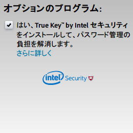

Adobe Foistware Killer
======================

User script for Greasemonkey / Tampermonkey which automatically unchecks the "Optional Offer" checkboxes on download pages of Adobe products

## Summary

[日本語版のREADME.mdはこちら](README.ja.md)

Adobe Foistware Killer is a user script for Greasemonkey / Tampermonkey which automatically unchecks the "Optional Offer" checkboxes on download pages of Adobe products.

The download pages of Adobe products (such as Flash Player or Acrobat Reader DC) pushes unrelated additional softwares you might not want to install (such as McAfee Security Scan Plus).

Although you can decline the offers by unchecking the checkboxes, they are checked _by default_. Therefore, you will end up installing unwanted softwares if you are too careless to uncheck the "Optional Offer" and click the "Install now" button.

This script detects Optional Offers on download pages of Adobe products and automatically unchecks all the checkboxes.

## License
[MIT License](http://opensource.org/licenses/MIT)

## Author
[たかだか。(TakaDaka.)](https://twitter.com/djtkdk_086969)